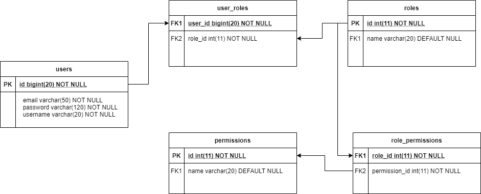

# Auth Service Task for Air Asia
## User Sign Up, User Login, Role and Permission module.
The diagram shows flow of how we implement User Registration, User Login and Authorization process.


The diagram shows the database design of the module.




## Dependency
 MySQL:
```xml
<dependency>
  <groupId>mysql</groupId>
  <artifactId>mysql-connector-java</artifactId>
  <scope>runtime</scope>
</dependency>
```
## Configure Spring Datasource, JPA, App properties
Open `src/main/resources/application.properties`

```
spring.datasource.url= jdbc:mysql://xxxxxxxxxxxxx
spring.datasource.username= xxxxx
spring.datasource.password= xxxx

spring.jpa.properties.hibernate.dialect= org.hibernate.dialect.MySQL5InnoDBDialect
spring.jpa.hibernate.ddl-auto= update

airasia.app.jwtSecret= airasiaSecretKey
airasia.app.jwtExpirationMs= 86400000
```
## Run Spring Boot application
```
mvn spring-boot:run
```
